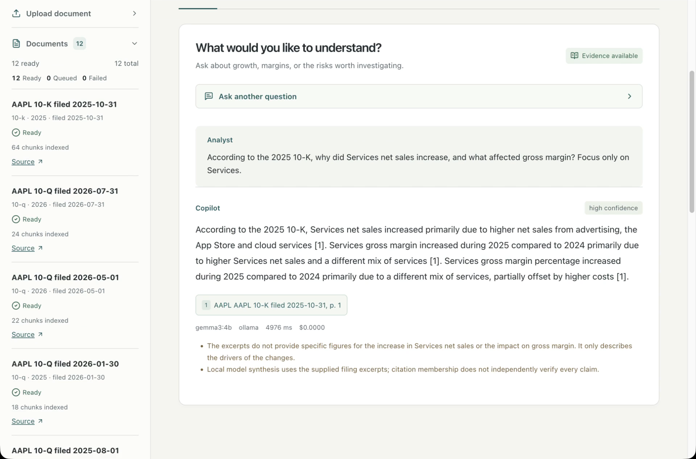

# Filings-First Research Agent Walkthrough

This document shows the product loop behind the AI Equity Research Copilot: ask a finance question, retrieve filing evidence first, synthesize only from cited context, and expose limitations when evidence is weak.

## Recorded real-model session

[](media/copilot-demo.mp4)

[Watch the MP4](media/copilot-demo.mp4): Gemma 3 4B via Ollama, recorded 2026-09-29; 71.5-second app-only edit with synthetic narration (OpenAI Marin). Apple corpus built through SEC EDGAR: 12 filings, 226 chunks. The cited research answer is accepted model output without fallback; the advice refusal is an application guardrail. [Response metadata, source manifest and recording notes](media/README.md). [Measured 35-case evaluation](../evals/results/2026-09-29/README.md).

The walkthrough below uses synthetic fixture responses and is separate from the recording.

## Demo Question

Question:

```text
What drove NVIDIA data center revenue growth?
```

Request shape:

```json
{
  "company_ids": ["11111111-1111-4111-8111-111111111111"],
  "question": "What drove NVIDIA data center revenue growth?",
  "document_types": ["10-k", "earnings_transcript"],
  "fiscal_years": [2025],
  "top_k": 8
}
```

## Retrieved Evidence

The fixture response returns two cited chunks:

| Source | Evidence | Score |
|---|---|---:|
| NVIDIA FY2025 10-K, p. 42 | Data center revenue increased primarily from demand for compute products used in generative AI and accelerated computing workloads. | 0.91 |
| NVIDIA FY2025 Q4 Earnings Call Transcript, pp. 6-7 | Customers were deploying systems for training and inference, and networking attach rates increased as clusters scaled. | 0.87 |

## Answer

NVIDIA data center revenue growth was driven by compute demand for generative AI and accelerated computing workloads, with additional support from networking demand as customers built larger AI clusters.

Key points:

- Compute products benefited from demand for generative AI and accelerated computing.
- Networking revenue increased as AI clusters scaled.

Confidence: `high`

## Deployment Notes

- The chat endpoint retrieves evidence before synthesis.
- Local deterministic synthesis is available through `AIERC_LLM_PROVIDER=local`.
- Ollama/Gemma can be used through `AIERC_LLM_PROVIDER=auto` or `ollama`.
- If model output has an invalid schema or invalid/missing citation references, the app falls back to deterministic cited synthesis. A valid low-confidence model response remains low-confidence; it is not promoted by adding extra citations.

## Design Notes

Applied AI tools usually fail in the messy middle: source quality, user trust, unsupported questions, and workflow fit. This project is designed around those seams:

- filings-first corpus building through SEC EDGAR,
- visible retrieval and citations,
- structured memos and company comparisons,
- explicit refusal behavior when evidence is not enough,
- finance QA evals for regression-style checks.

The design goal: turn an expert workflow into an inspectable AI tool rather than a black-box chat demo.
